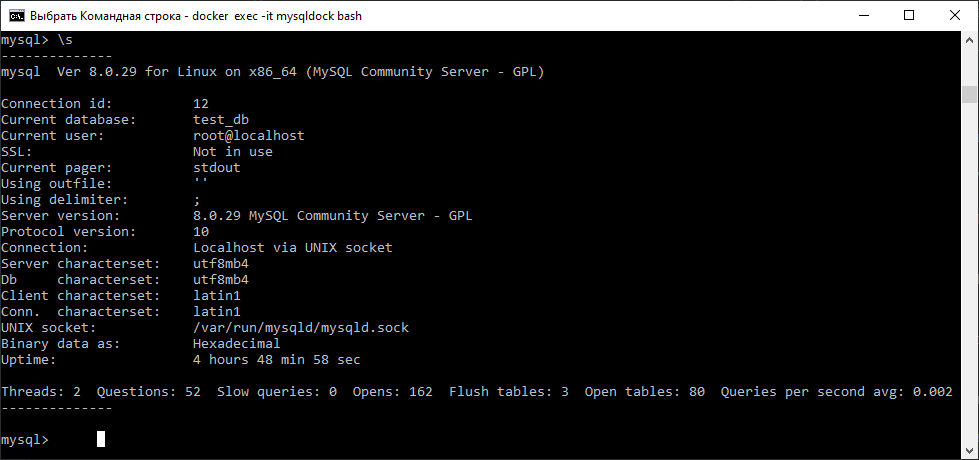
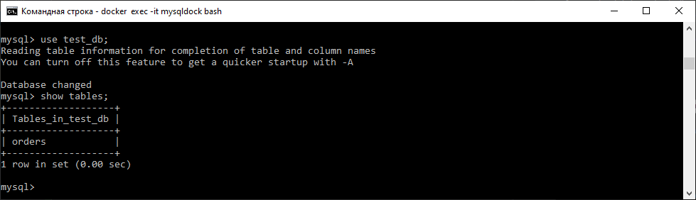
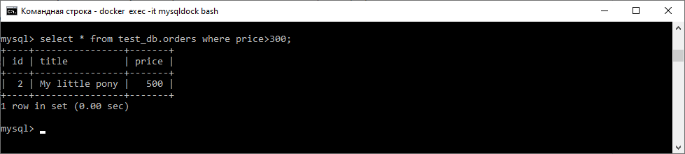
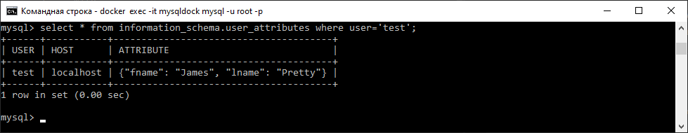
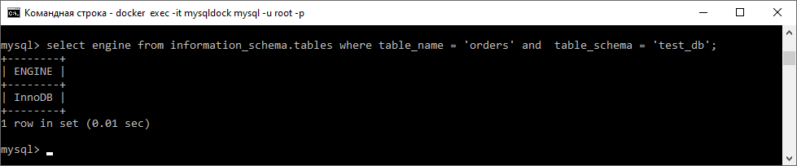
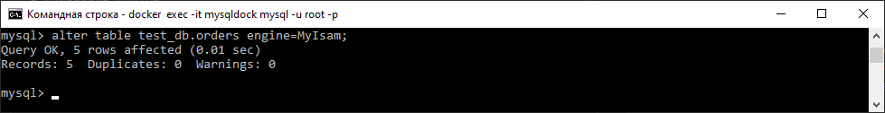
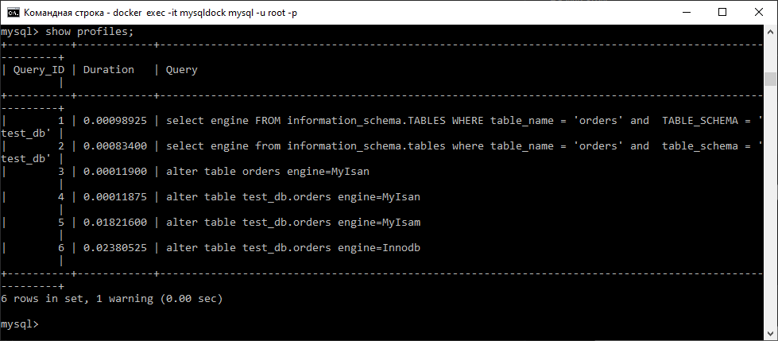
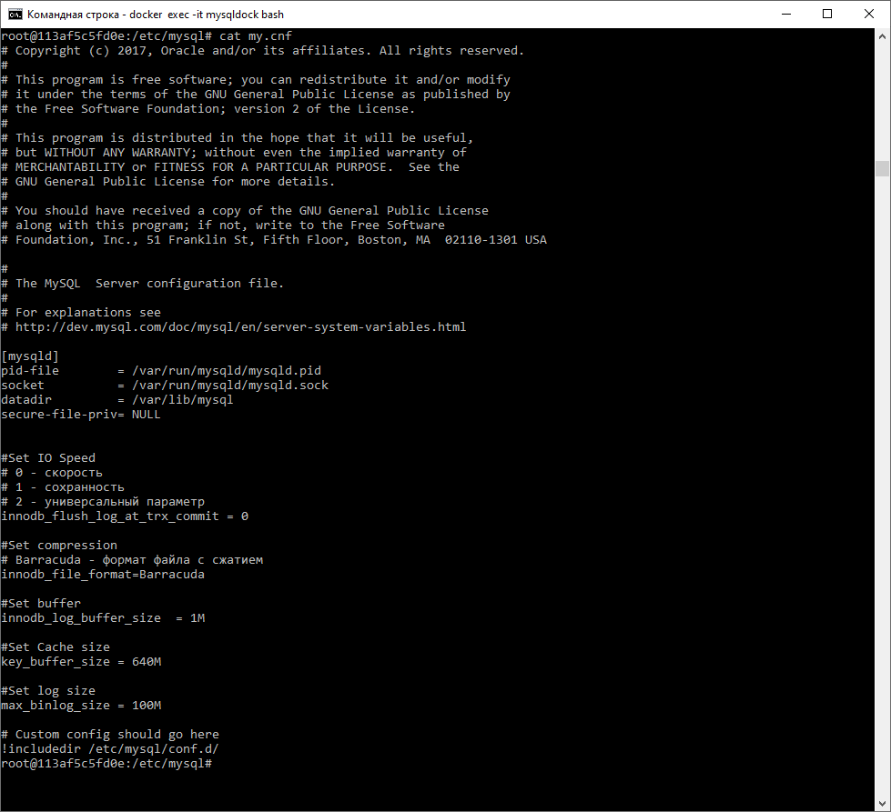

Задача 1
-

Используя docker поднимите инстанс MySQL (версию 8). Данные БД сохраните в volume.

Изучите бэкап БД и восстановитесь из него.

Перейдите в управляющую консоль mysql внутри контейнера.

Используя команду \h получите список управляющих команд.

Найдите команду для выдачи статуса БД и приведите в ответе из ее вывода версию сервера БД.

Подключитесь к восстановленной БД и получите список таблиц из этой БД.

Приведите в ответе количество записей с price > 300.

В следующих заданиях мы будем продолжать работу с данным контейнером.

---

  - Создание контейнера:

    C:\>docker run --name mysqldock -v C:\mysqlvol:/etc/mysql -p 3306:3306 -e MYSQL_ROOT_PASSWORD=5566496 -d mysql:8

  - Переход в управляющую консоль:

    
      C:\>docker exec -it mysqldock mysql -u root -p    

  - Восстановление БД из бэкапа:
    

    mysql> create database test_db ;
    Query OK, 1 row affected (0.00 sec)
    
    root@113af5c5fd0e:/# mysql -u root -p test_db < /test/test_dump.sql

  - Найдите команду для выдачи статуса БД и приведите в ответе из ее вывода версию сервера БД:

    
    
        8.0.29 MySQL Community Server - GPL

  - Подключение и список таблиц:

    

  - Записи с price>300:

    

---

Задача 2
-

Создайте пользователя test в БД c паролем test-pass, используя:

плагин авторизации mysql_native_password
срок истечения пароля - 180 дней
количество попыток авторизации - 3
максимальное количество запросов в час - 100
аттрибуты пользователя:
Фамилия "Pretty"
Имя "James"
Предоставьте привелегии пользователю test на операции SELECT базы test_db.

Используя таблицу INFORMATION_SCHEMA.USER_ATTRIBUTES получите данные по пользователю test и приведите в ответе к задаче.

---

  - Создание:

    mysql> create user 'test'@'localhost' identified by 'test-pass';
    Query OK, 0 rows affected (0.01 sec)

    mysql> alter user 'test'@'localhost' attribute '{"fname":"James", "lname":"Pretty"}';
    Query OK, 0 rows affected (0.01 sec)

    mysql> alter user 'test'@'localhost'
    ->     identified by 'test-pass'
    ->     with
    ->     max_queries_per_hour 100
    ->     password expire interval 180 day
    ->      failed_login_attempts 3 password_lock_time 2;
    Query OK, 0 rows affected (0.00 sec)

    mysql> grant select on test_db.orders to 'test'@'localhost';
    Query OK, 0 rows affected, 1 warning (0.00 sec)

  - Данные по пользователю test :

    

---

Задача 3
-

Установите профилирование SET profiling = 1. Изучите вывод профилирования команд SHOW PROFILES;.

Исследуйте, какой engine используется в таблице БД test_db и приведите в ответе.

Измените engine и приведите время выполнения и запрос на изменения из профайлера в ответе:

на MyISAM

на InnoDB

---

  - Установка профилирования:
    
        mysql> set profiling=1;
        Query OK, 0 rows affected, 1 warning (0.00 sec)
    

  - Engine в таблице test_db:

    

  - ИЗменение Engine:

    - MyISAM:
        
    - InnoDB:
        
      
  - Время выполнения:

    - 
      MyIsam :
      
            5 | 0.01821600 | alter table test_db.orders engine=MyIsam
      Innodb :
            
            6 | 0.02380525 | alter table test_db.orders engine=Innodb
    

---
Задача 4
-

Изучите файл my.cnf в директории /etc/mysql.

Измените его согласно ТЗ (движок InnoDB):

Скорость IO важнее сохранности данных

Нужна компрессия таблиц для экономии места на диске

Размер буффера с незакомиченными транзакциями 1 Мб

Буффер кеширования 30% от ОЗУ

Размер файла логов операций 100 Мб

Приведите в ответе измененный файл my.cnf.

---

